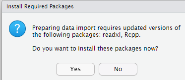

```{r setup, include=FALSE}
knitr::opts_chunk$set(echo = TRUE)
```

# Introduction

In this report we are going to discuss the evolution in the three versions of Lucene. For this goal, we need tools to make the analysis like R Studio, R, etc.
With this approach, will get metrics of the system in a clear way than other tools and also, R provide us the possibility of make our own metrics.

# Materials and methods

For our purpose, we need RStudio with R, the programming language itself. Also, the data in csv from the execution of Sourcemeter.
Furthermore, we will install some packages to load csv among others. 
Here is an example:



# System Metrics
Let us start with the main metrics, after import the excel, we will use R to read the excels.

## (Method Hiding Factor –MHF-)

This is the proportion of hiding methods. Firstly, we have to read the excels, we can do that with the __read.csv__ instruction, after that, we can save the columns need it in two variables. In this case, NM and NPM. The meaning of this two variables are _number of methods_ and _number of public methods_.


```{r}
luc49_Class  <- read.csv("Excel/Lucene4.9.0/luc49-Class.csv") 
luc491_Class  <- read.csv("Excel/Lucene4.9.1/luc491-Class.csv") 
luc41_Class  <- read.csv("Excel/Lucene4.10/luc410-Class.csv") 

NM <- luc49_Class[["NM"]];
NPM <- luc49_Class[["NPM"]];
Privado4.9 <- (1-(sum(NPM)/sum(NM)));
print(Privado4.9);

NM <- luc491_Class[["NM"]];
NPM <- luc491_Class[["NPM"]];
Privado4.9.1 <- (1-(sum(NPM)/sum(NM)));
print(Privado4.9.1);

NM <- luc41_Class[["NM"]];
NPM <- luc41_Class[["NPM"]];
Privado4.1 <- (1-(sum(NPM)/sum(NM)));
print(Privado4.1);
```

As we can see, we can get private methods proportion if we make the operation of divide number of public methods between all methods, then, subtract to one. 
In theory, with each version, MHF is increasing, which means that will be less bugs and technical debt, nevertheless, is very small in this case.

## (Attribute Hiding Factor –AHF-)

This is the proportion of hiding attributes. In this metric, we can make the same as before but in this case, changing the number of methods for attributes.
So, we are working here with the number of attributes and NPA, public attributes. The formula is almost the same, but we are working with that two columns. Special mention that in this case, we have a problem with the column, so the only option was use the number of the column, in my case, 43.

```{r}
NAtt <- luc49_Class[, 43];
NPA <- luc49_Class[["NPA"]];
APrivado <- 1-(sum(NPA)/sum(NAtt));
print(APrivado);

NAtt <- luc491_Class[, 43];
NPA <- luc491_Class[["NPA"]];
APrivado4.9.1 <- 1-(sum(NPA)/sum(NAtt));
print(APrivado4.9.1);

NAtt <- luc41_Class[, 43];
NPA <- luc41_Class[["NPA"]];
APrivado4_1 <- (1-(sum(NPA)/sum(NAtt)));
print(APrivado4_1);
```

Ideally, all attributes should be hidden, nevertheless, 56% it is a reasonable percentage. Anyways, we can see that in this case, there is a little decrease in the results between versions, but the idea would be increase the proportion of hidden attributes.


## (Method Inheritance Factor –MIF-)

Inheritance factor means the proportion of inherits methods. So, we can calculate it subtracting the total number of methods with local public methods.
After that, we have to divide it from the total number of methods.

```{r}
NM <- luc49_Class[["NM"]];
NLM <- luc49_Class[["NLM"]];
HEREADOS <- (NM - NLM);
MIF <- (sum(HEREADOS)/sum(NM));
print(MIF);

NM <- luc491_Class[["NM"]];
NLM <- luc491_Class[["NLM"]];
HEREADOS <- (NM - NLM);
MIF4.9.1 <- (sum(HEREADOS)/sum(NM));
print(MIF4.9.1);

NM <- luc41_Class[["NM"]];
NLM <- luc41_Class[["NLM"]];
HEREADOS <- (NM - NLM);
MIF4.1 <- (sum(HEREADOS)/sum(NM));
print(MIF4.1);
```

In this case, we have a high percentage. This range should not be low but also, not very high, this indicates either superfluous inheritance or too wide member scopes. In this example, the proportion is increasing, nevertheless, there is not a major change. 

## (Attribute Inheritance Factor –AIF-)

This metric is similar to MIF but in this case, we are talking about the attributes. 

```{r}
NAtt <- luc49_Class[, 43];
NLA <- luc49_Class[["NLA"]];
HEREADOS <- (NAtt - NLA);
MIF <- (sum(HEREADOS)/sum(NAtt));
print(MIF);

NAtt <- luc491_Class[, 43];
NLA <- luc491_Class[["NLA"]];
HEREADOS <- (NAtt - NLA);
MIF4.9.1 <- (sum(HEREADOS)/sum(NAtt));
print(MIF4.9.1);

NAtt <- luc41_Class[, 43];
NLA <- luc41_Class[["NLA"]];
HEREADOS <- (NAtt - NLA);
MIF4.1 <- (sum(HEREADOS)/sum(NAtt));
print(MIF4.1);
```

The results indicate that we may have a high rate of inherits attributes. As in MIF metrics, both should be lower, this could be done with the use of Interfaces instead of Inherits.


## Polymorphism Factor (PF)

This metric was impossible to get since we have not got the number of overrides methods. 
```{r}
#The formula should be something like:
# PF = overrides / sum for each class(new methods * descendants)
```

## (Coupling Factor –CF-)

This metric indicates the coupling factor, which measures couplings among classes. In other words, the communication between classes. 
This formula use the column CBO, which means the total number of classes that use other classes, furthermore, we have to use NOA, the number of ancestors.
To make the metric work, we need the number of total classes too. We have that number getting any column and measure it with length.

```{r}
CBO <- luc49_Class[["CBO"]];
NOA <- luc49_Class[["NOA"]];
numeroClases <- length(luc49_Class[["ID"]]);
NumR <- CBO-NOA;
CF <- (numeroClases - 1)/sum(NumR);
print(CF);

CBO <- luc491_Class[["CBO"]];
NOA <- luc491_Class[["NOA"]];
numeroClases <- length(luc491_Class[["ID"]]);
NumR <- CBO-NOA;
CF <- (numeroClases - 1)/sum(NumR);
print(CF);

CBO <- luc41_Class[["CBO"]];
NOA <- luc41_Class[["NOA"]];
numeroClases <- length(luc41_Class[["ID"]]);
NumR <- CBO-NOA;
CF <- (numeroClases - 1)/sum(NumR);
print(CF);
```
As we can see, we have also no big differences, nevertheless, we can see how the coupling factor is decreasing with every version.


## Personal metrics.

# Proportion Number of Methods for total lines of code.

We can create a new metric using the proportion of number of methods divide by lines of code. This could leads us to measure the complexity.

```{r}
LOC <- luc49_Class[["LOC"]];
NM <- luc49_Class[["NM"]];
Total <- (sum(LOC))/sum(NM);
print(Total);

LOC <- luc491_Class[["LOC"]];
NM <- luc491_Class[["NM"]];
Total <- (sum(LOC))/sum(NM);
print(Total);

LOC <- luc41_Class[["LOC"]];
NM <- luc41_Class[["NM"]];
Total <- (sum(LOC))/sum(NM);
print(Total);
```
In this case, the proportion is low, so we could think that in this case, there is not a large complexity, nevertheless, this may not be the best metric calculate the complexity, although is clearly that with every version, the complexity is lower.

# Conclusions

To sum-up, we have observe the difference with every version, it is seems clearly, that the previous version was better in most of the cases, meaning that with the new releases, a few things could change, leaving the code with less quality, nevertheless, this differences are also minimal. Some of the indicators, show us the necessity of do refactoring in the code, which can be a complex task in a big project like Lucene, although, some things like the number of inherit attributes should change in the future. 

